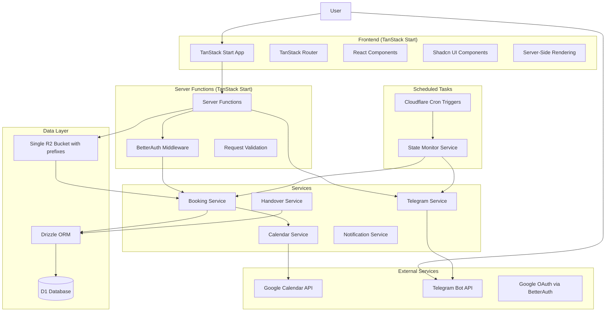

# MerikSirat System Design

## Overview

This design document outlines the architecture for the MerikSirat Equipment Booking System built on TanStack Start framework. The system leverages TanStack Start for full-stack React development, server functions for API endpoints, Cloudflare Workers for serverless execution, and integrates with Google Calendar and Telegram Bot for comprehensive equipment management.

### Design Goals
- **Accountability-First**: Track equipment movement with photo evidence and clear handovers
- **Web-First with Telegram Convenience**: Primary web interface with Telegram bot for notifications and quick actions
- **Unit-Level Granularity**: Every physical unit has unique identity and Google Calendar
- **Serverless Efficiency**: Use Cloudflare's stack within free tier limits
- **Calendar-Driven**: Google Calendar as availability source of truth

### Key Design Decisions
- **TanStack Start Framework**: Modern full-stack React framework with SSR and streaming
- **Unit-Level Identity**: Each physical item (e.g., "SD Card Unit 4") has dedicated Google Calendar ID
- **Shopping Cart Model**: Multi-item booking sessions with independent time slots per unit
- **Single R2 Bucket with Prefixes**: Use one bucket with `return-photos/` and `equipment-images/` prefixes
- **BetterAuth Integration**: Google OAuth accepting any valid Google email domain
- **Drizzle ORM**: Type-safe database layer for D1 database management
- **Telegram Webhooks**: Real-time notifications and convenience commands

## Architecture

### High-Level Architecture



### Technology Stack

| Layer | Technology | Status |
|-------|------------|--------|
| Frontend | **TanStack Start** + **React 19** | Framework choice |
| Routing | **TanStack Router** | Type-safe routing |
| UI Components | **Shadcn UI** + Tailwind | Component library |
| Server Functions | **TanStack Start Server Functions** | API endpoints |
| Database | **D1** with **Drizzle ORM** | Type-safe database layer |
| Authentication | **BetterAuth** with Google OAuth | Any Google email accepted |
| Storage | **R2** (single bucket with prefixes) | File storage |
| Infrastructure | **Cloudflare Workers** | Serverless platform |
| Notifications | **Telegram Bot API** with Webhooks | Real-time notifications |
| State Management | **TanStack Query** + React Context | Client state |
| Scheduled Tasks | **Cloudflare Cron Triggers** | Background jobs |

## Components and Interfaces

### Frontend Structure (TanStack Start Routes)

**`app/routes/dashboard/equipment.tsx`** - Equipment catalog with shopping cart
- Grid/datatable view toggle (AC-004)
- Real-time status display with current holder transparency
- Filtering by category/status/current holder
- Clearance level-based visibility (TR-011)
- Shopping cart interface for multi-item selection

**`app/routes/dashboard/bookings.tsx`** - Booking management
- Shopping cart checkout with independent time slots per unit (AC-003)
- Calendar time selection with availability checking
- Booking confirmation with Google Calendar integration
- Policy enforcement (max duration, lead time) (TR-012)

**`app/routes/dashboard/bookingss.tsx`** - User's active bookings
- Active bookings list with status tracking
- "Confirm Pickup" button for bookings within 30 minutes (TR-003)
- Handover initiation with recipient selection (AC-005)
- Return flow with photo upload (AC-006)
- Partial return and session splitting (AC-007)
- Extension requests with "+30 mins" button (AC-008)

**`app/routes/admin/equipment.tsx`** - Admin equipment management
- CRUD for equipment with unit-level granularity (TR-001)
- Google Calendar ID mapping per unit
- Equipment images upload to R2
- Clearance level assignment (TR-011)
- Deactivation and maintenance mode toggles (AC-009)

**`app/routes/admin/users.tsx`** - User management
- Clearance level assignment with bulk actions (AC-010)
- User statistics and booking history
- CSV export functionality (TR-004)
- Role management (user/admin/super_admin)

**`app/routes/admin/maintenance.tsx`** - Maintenance tools dashboard
- Calendar cleanup tools (delete/bulk/archive) (AC-010)
- Database export and backup functionality
- User management tools with bulk operations
- System statistics and health monitoring

**`app/routes/auth/onboarding.tsx`** - Mandatory profile completion
- First name, surname collection (AC-001)
- Telegram account linking via deep link
- Optional birthday field
- Profile completion enforcement before booking access

### Server Functions Structure (TanStack Start API)

Following TanStack Start's server function pattern in `app/routes/api/`:

**`app/routes/api/bookings.ts`** - Booking operations
- `createBooking` - Multi-unit session creation with availability validation
- `getBooking` - Booking details with status calculation
- `updateBooking` - Modify bookings before start time
- `cancelBooking` - Cancel with calendar cleanup
- `confirmPickup` - Transition to "In Use" status (TR-003)
- `extendBooking` - "+30 mins" extension with conflict checking

**`app/routes/api/equipment.ts`** - Equipment operations
- `getEquipmentCatalog` - List with real-time availability and clearance filtering
- `getEquipmentDetails` - Individual unit details with current holder info
- `createEquipment` - Admin unit creation with calendar ID (TR-001)
- `updateEquipment` - Admin equipment management
- `toggleEquipmentStatus` - Deactivation and maintenance mode

**`app/routes/api/handover.ts`** - Handover operations
- `initiateHandover` - Start handover process with recipient selection
- `acceptHandover` - Recipient acceptance with checklist validation (TR-007)
- `declineHandover` - Rejection with optional issue reporting
- `cancelHandover` - Timeout or manual cancellation

**`app/routes/api/returns.ts`** - Return operations
- `returnEquipment` - Full return with photo upload to R2
- `partialReturn` - Session splitting with grace period logic (AC-007)
- `uploadReturnPhoto` - R2 upload with admin notification

**`app/routes/api/telegram.ts`** - Telegram webhook and bot management
- `handleWebhook` - Process Telegram updates and commands
- `setWebhook` - Configure webhook URL
- `sendNotification` - Send alerts and status updates
- `linkTelegramAccount` - Token-based account linking (AC-002)

**`app/routes/api/auth.ts`** - Authentication with BetterAuth
- `googleAuth` - Initiate Google OAuth flow
- `handleCallback` - Process OAuth callback and session creation
- `logout` - Session termination
- `getProfile` - User profile with completion status

### Key Services Implementation

**Booking Service** (`app/lib/services/booking.ts`):
- Multi-unit session management with independent time slots
- Google Calendar availability validation via freeBusy API
- State transition management (reserved → awaiting_pickup → in_use → returned)
- Auto-cancellation logic for no-shows (TR-006)
- Grace period and session splitting logic (AC-007)
- Policy enforcement (duration limits, lead time) (TR-012)

**Calendar Service** (`app/lib/services/calendar.ts`):
- Google Calendar API integration with OAuth scopes
- Unit-level calendar management (TR-001, TR-002)
- Event creation with standardized titles and descriptions
- FreeBusy checks for availability validation
- Event updates for status changes (IN USE, RETURNED tags)
- Cleanup and archival operations (AC-010)

**Telegram Service** (`app/lib/services/telegram.ts`):
- Webhook-based bot command handling (TR-013)
- Account linking with secure token generation (AC-002)
- Real-time notifications for booking events
- Quick-action commands (/status, /handover, /end_booking) (TR-008)
- Photo forwarding to admin for return verification
- Public feed alerts for overdue equipment (TR-009)

**Handover Service** (`app/lib/services/handover.ts`):
- Handover initiation with recipient suggestion logic
- Checklist validation and confirmation flow (TR-007)
- Timeout handling (15-minute window)
- Status transitions between users
- Maintenance flagging for declined handovers

**Auth Service** (`app/lib/services/auth.ts`):
- BetterAuth integration with Google OAuth
- Profile completion enforcement (AC-001)
- Session management with secure cookies
- Role-based access control (user/admin/super_admin)
- Clearance level authorization (TR-011)

**Storage Service** (`app/lib/services/storage.ts`):
- R2 file upload with organized prefixes
- Signed URL generation for secure access (TR-014)
- Lifecycle management (60-day retention for return photos)
- Image validation and processing
- Backup and export functionality (TR-017)

**State Monitor Service** (`app/lib/services/state-monitor.ts`):
- Cron job integration for scheduled tasks (TR-006)
- Overdue detection and alert generation
- Auto-cancellation for no-shows
- Grace period monitoring and transitions
- System health checks and maintenance alerts

## Data Models

**`app/lib/db/schema.ts`** (Drizzle ORM Schema):

```typescript
import { sqliteTable, text, integer } from 'drizzle-orm/sqlite-core';

// Users with mandatory profile completion
export const user = sqliteTable('user', {
  id: text('id').primaryKey(),
  googleId: text('google_id').unique().notNull(),
  email: text('email').notNull().unique(),
  firstName: text('first_name'), // Required during onboarding
  lastName: text('last_name'), // Required during onboarding
  telegramChatId: text('telegram_chat_id'), // Required during onboarding
  telegramUsername: text('telegram_username'), // Auto-updated from bot
  birthday: text('birthday'), // Optional
  clearanceLevel: integer('clearance_level').default(1), // TR-011
  role: text('role', { enum: ['user', 'admin', 'super_admin'] }).default('user'),
  profileCompleted: integer('profile_completed', { mode: 'boolean' }).default(false),
  createdAt: integer('created_at', { mode: 'timestamp' }).$defaultFn(() => new Date()),
  updatedAt: integer('updated_at', { mode: 'timestamp' }).$defaultFn(() => new Date()),
});

// Equipment with unit-level granularity (TR-001)
export const equipment = sqliteTable('equipment', {
  id: text('id').primaryKey(),
  modelName: text('model_name').notNull(),
  description: text('description'),
  categoryId: text('category_id').references(() => categories.id),
  uniqueIdentifier: text('unique_identifier').notNull().unique(), // Physical unit ID
  gCalId: text('gcal_id').notNull().unique(), // Dedicated calendar per unit
  requiredClearanceLevel: integer('required_clearance_level').default(1),
  imagePath: text('image_path'), // R2 path: equipment-images/{id}.jpg
  isActive: integer('is_active', { mode: 'boolean' }).default(true),
  maintenanceMode: integer('maintenance_mode', { mode: 'boolean' }).default(false),
  createdAt: integer('created_at', { mode: 'timestamp' }).$defaultFn(() => new Date()),
  updatedAt: integer('updated_at', { mode: 'timestamp' }).$defaultFn(() => new Date()),
});

// Bookings with comprehensive status tracking
export const bookings = sqliteTable('bookings', {
  id: text('id').primaryKey(),
  userId: text('user_id').notNull().references(() => users.id),
  equipmentId: text('equipment_id').notNull().references(() => equipment.id),
  sessionId: text('session_id').notNull(), // Groups multi-unit bookings
  startTime: integer('start_time', { mode: 'timestamp' }).notNull(),
  endTime: integer('end_time', { mode: 'timestamp' }).notNull(),
  status: text('status', {
    enum: [
      'reserved', 'awaiting_pickup', 'in_use', 'pending_handover', 
      'returned', 'cancelled', 'overdue', 'grace_period', 
      'lost_due_to_pending_return', 'completed_handover'
    ]
  }).notNull().default('reserved'),
  gCalEventId: text('gcal_event_id'), // Google Calendar event ID
  userEventDetails: text('user_event_details'), // User-provided booking notes
  returnPhotoPath: text('return_photo_path'), // R2 path with timestamp format
  handoverToUserId: text('handover_to_user_id').references(() => users.id),
  originalBookingId: text('original_booking_id').references(() => bookings.id), // For splits
  noShowLogged: integer('no_show_logged', { mode: 'boolean' }).default(false),
  createdAt: integer('created_at', { mode: 'timestamp' }).$defaultFn(() => new Date()),
  updatedAt: integer('updated_at', { mode: 'timestamp' }).$defaultFn(() => new Date()),
});

// Categories for equipment organization
export const categories = sqliteTable('categories', {
  id: text('id').primaryKey(),
  name: text('name').notNull().unique(),
  description: text('description'),
  sortOrder: integer('sort_order').default(0),
  createdAt: integer('created_at', { mode: 'timestamp' }).$defaultFn(() => new Date()),
});

// Global settings with admin-editable policies
export const settings = sqliteTable('settings', {
  id: text('id').primaryKey().default('global'),
  equipmentNotes: text('equipment_notes').default(''), // Included in all notifications
  maxBookingHours: integer('max_booking_hours').default(24), // TR-012
  maxLeadTimeDays: integer('max_lead_time_days').default(14), // TR-012
  handoverChecklist: text('handover_checklist').default(
    '["Glass is scratch-free", "Sensor is clean", "Battery is present", "No physical damage"]'
  ), // TR-007
  gracePeriodMinutes: integer('grace_period_minutes').default(30),
  pickupWindowMinutes: integer('pickup_window_minutes').default(30), // TR-003
  createdAt: integer('created_at', { mode: 'timestamp' }).$defaultFn(() => new Date()),
  updatedAt: integer('updated_at', { mode: 'timestamp' }).$defaultFn(() => new Date()),
});

// Telegram linking tokens for secure account connection
export const telegramTokens = sqliteTable('telegram_tokens', {
  id: text('id').primaryKey(),
  token: text('token').notNull().unique(),
  userId: text('user_id').notNull().references(() => users.id),
  expiresAt: integer('expires_at', { mode: 'timestamp' }).notNull(),
  used: integer('used', { mode: 'boolean' }).default(false),
  createdAt: integer('created_at', { mode: 'timestamp' }).$defaultFn(() => new Date()),
});

// Handover tracking for accountability
export const handovers = sqliteTable('handovers', {
  id: text('id').primaryKey(),
  bookingId: text('booking_id').notNull().references(() => bookings.id),
  fromUserId: text('from_user_id').notNull().references(() => users.id),
  toUserId: text('to_user_id').notNull().references(() => users.id),
  status: text('status', { 
    enum: ['initiated', 'accepted', 'declined', 'timeout', 'cancelled'] 
  }).notNull(),
  checklistCompleted: integer('checklist_completed', { mode: 'boolean' }).default(false),
  declineReason: text('decline_reason'), // For maintenance flagging
  createdAt: integer('created_at', { mode: 'timestamp' }).$defaultFn(() => new Date()),
  completedAt: integer('completed_at', { mode: 'timestamp' }),
});

// Audit logs for system accountability
export const auditLogs = sqliteTable('audit_logs', {
  id: text('id').primaryKey(),
  action: text('action').notNull(), // booking_created, handover_completed, etc.
  userId: text('user_id').references(() => users.id),
  entityType: text('entity_type'), // booking, equipment, user
  entityId: text('entity_id'),
  details: text('details'), // JSON string with additional context
  ipAddress: text('ip_address'),
  userAgent: text('user_agent'),
  createdAt: integer('created_at', { mode: 'timestamp' }).$defaultFn(() => new Date()),
});

// System notifications and alerts
export const notifications = sqliteTable('notifications', {
  id: text('id').primaryKey(),
  userId: text('user_id').references(() => users.id),
  type: text('type', { 
    enum: ['booking_reminder', 'overdue_alert', 'handover_request', 'return_reminder'] 
  }).notNull(),
  title: text('title').notNull(),
  message: text('message').notNull(),
  read: integer('read', { mode: 'boolean' }).default(false),
  telegramSent: integer('telegram_sent', { mode: 'boolean' }).default(false),
  relatedEntityType: text('related_entity_type'),
  relatedEntityId: text('related_entity_id'),
  createdAt: integer('created_at', { mode: 'timestamp' }).$defaultFn(() => new Date()),
});
```

## Storage Design

### Single R2 Bucket Structure

```
meriksirat-storage/ (R2 bucket)
├── return-photos/           # Auto-delete after 60 days
│   ├── 20250120_123456_user1_equip1.jpg
│   ├── 20250121_234567_user2_equip2.jpg
│   └── ...
├── equipment-images/        # No auto-delete
│   ├── camera-sony-a7iii.jpg
│   ├── lens-24-70.jpg
│   └── ...
└── backups/                # Database backups
    ├── 20250120_120000.json
    ├── 20250121_120000.json
    └── ...
```

## API Design

### Authentication Flow with BetterAuth
1. User clicks "Sign in with Google" on frontend
2. BetterAuth initiates Google OAuth flow (accepts any Google email)
3. Google redirects to BetterAuth callback handler
4. System checks profile completion status
5. If incomplete, redirects to mandatory onboarding page
6. If complete, redirects to dashboard with session

### Profile Onboarding Flow (AC-001)
1. User completes Google OAuth but has incomplete profile
2. System redirects to `/auth/onboarding` (mandatory)
3. User provides: First Name, Last Name (required)
4. System generates Telegram linking token and deep link
5. User clicks deep link to connect Telegram account
6. Optional: User provides birthday
7. Profile marked complete, user gains booking access

### Shopping Cart Booking Flow (AC-003)

**Server Function**: `app/routes/api/bookings.ts`

```typescript
import { createServerFn } from '@tanstack/start';
import { z } from 'zod';
import { requireAuth } from '~/lib/auth/middleware';
import { validateAvailability, createMultiUnitBooking } from '~/lib/services/booking';

const bookingSchema = z.object({
  items: z.array(z.object({
    equipmentId: z.string(),
    startTime: z.string().datetime(),
    endTime: z.string().datetime(),
  })).min(1),
  sessionId: z.string(),
  eventDetails: z.string().optional(),
});

export const createBooking = createServerFn({ method: 'POST' })
  .middleware([requireAuth])
  .validator(bookingSchema)
  .handler(async ({ data, context }) => {
    const user = context.user;
    
    // Validate each unit's availability via Google Calendar freeBusy
    const conflicts = await validateAvailability(data.items);
    if (conflicts.length > 0) {
      throw new Error(`Booking conflicts: ${conflicts.map(c => 
        `${c.equipmentId} at ${c.conflictTime}`).join(', ')}`);
    }
    
    // Create multi-unit session with individual calendar events
    const result = await createMultiUnitBooking({
      userId: user.id,
      sessionId: data.sessionId,
      items: data.items,
      eventDetails: data.eventDetails,
    });

    return { success: true, bookingIds: result.bookingIds };
  });
```

### Handover Flow Implementation (AC-005)

**Server Function**: `app/routes/api/handover.ts`

```typescript
export const initiateHandover = createServerFn({ method: 'POST' })
  .middleware([requireAuth])
  .validator(z.object({
    bookingId: z.string(),
    recipientId: z.string().optional(), // If not provided, suggest from upcoming bookings
  }))
  .handler(async ({ data, context }) => {
    const user = context.user;
    
    // Validate user owns the booking and it's "in_use"
    const booking = await getBookingById(data.bookingId);
    if (booking.userId !== user.id || booking.status !== 'in_use') {
      throw new Error('Invalid handover request');
    }
    
    // Suggest recipients if not provided
    let recipientId = data.recipientId;
    if (!recipientId) {
      const suggestions = await getUpcomingBookingsForEquipment(
        booking.equipmentId, 
        new Date(), 
        4 // hours
      );
      if (suggestions.length === 0) {
        throw new Error('No upcoming bookings found. Please select recipient manually.');
      }
      recipientId = suggestions[0].userId;
    }
    
    // Create handover record and update booking status
    const handover = await createHandover({
      bookingId: data.bookingId,
      fromUserId: user.id,
      toUserId: recipientId,
    });
    
    await updateBookingStatus(data.bookingId, 'pending_handover');
    
    // Send Telegram notification to recipient
    await sendHandoverNotification(recipientId, {
      fromUser: user,
      equipment: booking.equipment,
      handoverId: handover.id,
    });
    
    return { success: true, handoverId: handover.id };
  });
```

### Telegram Webhook Integration (TR-013)

**Server Function**: `app/routes/api/telegram.ts`

```typescript
export const handleWebhook = createServerFn({ method: 'POST' })
  .handler(async ({ request }) => {
    const update = await request.json();
    
    // Handle in background to avoid timeout
    const promise = processTelegramUpdate(update).catch((err) => {
      console.error('Telegram webhook error:', err);
    });
    
    // Don't await - return immediately
    return { ok: true };
  });

async function processTelegramUpdate(update: TelegramUpdate) {
  if (update.message?.text?.startsWith('/')) {
    await handleBotCommand(update);
  } else if (update.callback_query) {
    await handleCallbackQuery(update.callback_query);
  } else if (update.message?.photo) {
    await handlePhotoUpload(update);
  }
}

async function handleBotCommand(update: TelegramUpdate) {
  const command = update.message.text;
  const chatId = update.message.chat.id;
  
  switch (command.split(' ')[0]) {
    case '/start':
      const token = command.split(' ')[1];
      if (token) {
        await linkTelegramAccount(token, chatId, update.message.from.username);
      } else {
        await sendWelcomeMessage(chatId);
      }
      break;
      
    case '/status':
      await sendEquipmentStatus(chatId);
      break;
      
    case '/mybookings':
      await sendUserBookings(chatId);
      break;
      
    case '/handover':
      await initiateHandoverFlow(chatId);
      break;
      
    case '/end_booking':
      await initiateReturnFlow(chatId);
      break;
      
    default:
      await sendHelpMessage(chatId);
  }
}
```

### Cron Job Integration (TR-006)

**Scheduled Function**: `app/routes/api/cron.ts`

```typescript
export const stateMonitor = createServerFn({ method: 'POST' })
  .handler(async () => {
    const now = new Date();
    
    // Check for bookings that should transition to "awaiting_pickup"
    const upcomingBookings = await getBookingsStartingNow(now);
    for (const booking of upcomingBookings) {
      await updateBookingStatus(booking.id, 'awaiting_pickup');
      await sendPickupReminder(booking.userId, booking);
    }
    
    // Check for no-shows (30 minutes past start without pickup confirmation)
    const noShowBookings = await getNoShowBookings(now);
    for (const booking of noShowBookings) {
      await cancelBookingForNoShow(booking.id);
      await logNoShowIncident(booking.userId, booking);
    }
    
    // Check for overdue equipment
    const overdueBookings = await getOverdueBookings(now);
    for (const booking of overdueBookings) {
      await updateBookingStatus(booking.id, 'overdue');
      await sendOverdueAlert(booking.userId, booking);
      await postToClubFeed(booking); // TR-009
    }
    
    // Check for grace period violations
    const gracePeriodViolations = await getGracePeriodViolations(now);
    for (const booking of gracePeriodViolations) {
      await handleGracePeriodViolation(booking);
    }
    
    return { processed: true, timestamp: now.toISOString() };
  });
```

## Security Considerations

### Authentication & Authorization Implementation
1. **BetterAuth Integration**: Google OAuth 2.0 flow accepting any valid Google email domain
2. **Profile Completion Enforcement**: Block booking access until mandatory fields completed (AC-001)
3. **Session Management**: Secure HTTP-only cookies with proper expiration
4. **Role-Based Access Control**: User, Admin, Super-Admin roles with route protection
5. **Clearance Level Authorization**: Equipment visibility based on user clearance (TR-011)
6. **CSRF Protection**: Built-in CSRF tokens with BetterAuth
7. **Secure Cookies**: `Secure`, `HttpOnly`, `SameSite=Strict` attributes

### API Security
1. **Input Validation**: Zod schemas for all server function inputs
2. **Rate Limiting**: 100 requests per 5 minutes per IP (NFR-004)
3. **Authentication Middleware**: Protect all sensitive endpoints
4. **Audit Logging**: Track all significant actions with user context
5. **Error Handling**: Sanitized error responses without sensitive data

### Storage Security (TR-014)
1. **R2 Private Buckets**: All buckets configured as private
2. **Signed URLs**: Generate temporary URLs for photo access (24-hour expiration)
3. **File Validation**: Validate file types (JPEG, PNG, WebP) and sizes (max 10MB)
4. **Path Sanitization**: Prevent directory traversal in file paths
5. **Lifecycle Policies**: Auto-delete return photos after 60 days
6. **Admin Photo Forwarding**: Return photos forwarded to admin Telegram for verification

### Telegram Security
1. **Webhook Validation**: Verify Telegram webhook signatures
2. **Token-Based Linking**: Secure one-time tokens for account linking (AC-002)
3. **Command Authorization**: Verify user identity before processing commands
4. **Rate Limiting**: Prevent spam and abuse of bot commands
5. **Sensitive Data Protection**: Never expose user emails or internal IDs in bot messages

## Implementation Priority

### Phase 1: Foundation & Authentication (Weeks 1-2)
1. **TanStack Start Setup**: Initialize project with proper routing structure
2. **Database Schema**: Implement Drizzle ORM with complete schema (TR-001)
3. **BetterAuth Integration**: Google OAuth with profile completion enforcement (AC-001)
4. **Telegram Account Linking**: Token-based linking system (AC-002)
5. **Basic UI Framework**: Shadcn UI components and responsive layouts
6. **R2 Configuration**: Single bucket setup with lifecycle policies (TR-014)

### Phase 2: Core Booking System (Weeks 3-4)
1. **Equipment Management**: Unit-level CRUD with Google Calendar integration (TR-001, TR-002)
2. **Shopping Cart Interface**: Multi-unit booking with independent time slots (AC-003)
3. **Calendar Integration**: Google Calendar API with freeBusy validation
4. **Booking Flow**: Complete reservation to pickup confirmation workflow (TR-003)
5. **Clearance System**: User tiering and equipment visibility (TR-011)
6. **Policy Enforcement**: Duration limits and lead time validation (TR-012)

### Phase 3: Telegram Bot & Notifications (Weeks 5-6)
1. **Telegram Webhook**: Bot setup with command handling (TR-013)
2. **Basic Commands**: `/status`, `/mybookings`, `/help` implementation (TR-008)
3. **Notification System**: Real-time alerts for booking events
4. **Quick Actions**: Pickup confirmation and basic return via bot
5. **Admin Notifications**: Return photo forwarding and overdue alerts

### Phase 4: Handover & Returns (Weeks 7-8)
1. **Handover Workflow**: Web and Telegram handover with recipient selection (AC-005)
2. **Checklist System**: Admin-defined validation with maintenance flagging (TR-007)
3. **Photo Returns**: R2 upload with admin forwarding (AC-006)
4. **Partial Returns**: Session splitting with grace period logic (AC-007)
5. **Extension System**: "+30 mins" functionality with conflict checking (AC-008)

### Phase 5: Admin Tools & Monitoring (Weeks 9-10)
1. **Admin Dashboard**: Equipment and user management interfaces (AC-009, AC-010)
2. **Maintenance Tools**: Calendar cleanup, database export, bulk operations
3. **Cron Jobs**: State monitoring and auto-cancellation system (TR-006)
4. **Audit System**: Comprehensive logging and reporting
5. **Analytics**: Equipment utilization and user behavior metrics

### Phase 6: Advanced Features & Polish (Weeks 11-12)
1. **Public Feed**: Overdue alerts to club Telegram channel (TR-009)
2. **Advanced Notifications**: Reminder system and escalation logic
3. **Mobile Optimization**: Enhanced mobile experience for on-site usage (NFR-005)
4. **Performance Optimization**: Caching and query optimization
5. **Testing & Documentation**: Comprehensive test suite and user guides

## Development Setup

### Prerequisites
1. **Cloudflare Account**: Workers and D1 database access
2. **Google Cloud Project**: OAuth credentials and Calendar API access
3. **Telegram Bot**: Bot token from BotFather
4. **Node.js**: Version 18+ with npm/pnpm

### Local Development Environment
```bash
# Clone and install dependencies
git clone <repository>
cd meriksirat-system
npm install

# Configure environment variables
cp .env.example .env.local
# Edit .env.local with your credentials:
# - GOOGLE_CLIENT_ID
# - GOOGLE_CLIENT_SECRET  
# - TELEGRAM_BOT_TOKEN
# - DATABASE_URL (local D1)
# - R2_BUCKET_NAME

# Initialize database
npm run db:generate
npm run db:migrate

# Start development server
npm run dev
```

### TanStack Start Configuration
```typescript
// app.config.ts
import { defineConfig } from '@tanstack/start/config'
import { cloudflareDevProxyVitePlugin } from '@cloudflare/vitest-pool-workers/config'

export default defineConfig({
  vite: {
    plugins: [
      cloudflareDevProxyVitePlugin({
        configPath: './wrangler.toml',
        environment: 'development',
        experimentalJsonConfig: true,
      }),
    ],
  },
  server: {
    preset: 'cloudflare-workers',
  },
})
```

### Production Deployment
```bash
# Configure Wrangler CLI
npx wrangler login

# Create D1 database
npx wrangler d1 create meriksirat-db
# Copy database ID to wrangler.toml

# Create R2 bucket
npx wrangler r2 bucket create meriksirat-storage
# Copy bucket name to wrangler.toml

# Set production secrets
npx wrangler secret put GOOGLE_CLIENT_ID
npx wrangler secret put GOOGLE_CLIENT_SECRET
npx wrangler secret put TELEGRAM_BOT_TOKEN
npx wrangler secret put BETTER_AUTH_SECRET

# Run database migrations
npx wrangler d1 migrations apply meriksirat-db

# Deploy application
npm run deploy

# Set up Telegram webhook
curl -X POST "https://api.telegram.org/bot<TOKEN>/setWebhook" \
  -H "Content-Type: application/json" \
  -d '{"url": "https://your-worker.your-subdomain.workers.dev/api/telegram/webhook"}'

# Configure cron triggers in wrangler.toml
```

## Framework Integration Notes

### TanStack Start Features Utilized
- ✅ **File-based Routing**: `app/routes/` structure for pages and API endpoints
- ✅ **Server Functions**: Type-safe API endpoints with built-in validation
- ✅ **Server-Side Rendering**: SSR for improved performance and SEO
- ✅ **Streaming**: Progressive page loading for better UX
- ✅ **TanStack Router**: Type-safe client-side routing and navigation
- ✅ **TanStack Query**: Server state management and caching
- ✅ **Cloudflare Workers**: Optimized for serverless deployment

### Key Integrations to Implement
- 🔄 **BetterAuth**: Google OAuth with profile completion enforcement
- 🔄 **Drizzle ORM**: Type-safe database operations with D1
- 🔄 **R2 Storage**: File upload and lifecycle management
- 🔄 **Telegram Bot**: Webhook-based notifications and commands
- 🔄 **Google Calendar API**: Availability validation and event management
- 🔄 **Cloudflare Cron**: Scheduled state monitoring and cleanup
- 🔄 **Shadcn UI**: Consistent component library with Tailwind

### Configuration Files
- `app.config.ts` - TanStack Start configuration
- `wrangler.toml` - Cloudflare Workers deployment config
- `drizzle.config.ts` - Database configuration and migrations
- `.env.local` - Local development environment variables
- `better-auth.config.ts` - Authentication provider configuration

## Testing Strategy

### Unit Testing
- **React Components**: Testing Library with Jest for component behavior
- **Server Functions**: TanStack Start testing utilities for API endpoints
- **Service Layer**: Isolated testing of business logic functions
- **Database Operations**: In-memory SQLite for Drizzle ORM testing
- **Utility Functions**: Pure function testing with comprehensive edge cases

### Integration Testing
- **Authentication Flow**: BetterAuth integration with Google OAuth mocking
- **Booking Workflow**: End-to-end booking creation and status transitions
- **Calendar Integration**: Google Calendar API with service account testing
- **Telegram Bot**: Webhook processing and command handling
- **File Upload**: R2 storage operations with local testing environment

### End-to-End Testing
- **Critical User Flows**: Playwright for browser automation
  - Complete booking workflow (catalog → cart → confirmation → pickup → return)
  - Handover process between users
  - Admin equipment and user management
  - Profile onboarding with Telegram linking
- **Mobile Responsiveness**: Cross-device testing for mobile-first design
- **Performance Testing**: Load testing for concurrent booking scenarios

### Property-Based Testing
- **Booking Validation**: Generate random booking scenarios to test conflict detection
- **Calendar Synchronization**: Verify Google Calendar consistency across operations
- **State Transitions**: Test all valid booking status transitions
- **Permission Systems**: Validate clearance level access controls

### Testing Environment Setup
```bash
# Install testing dependencies
npm install -D @testing-library/react @testing-library/jest-dom
npm install -D vitest @vitest/ui playwright

# Configure test database
export TEST_DATABASE_URL="file:./test.db"

# Run test suites
npm run test:unit        # Unit tests
npm run test:integration # Integration tests  
npm run test:e2e        # End-to-end tests
npm run test:coverage   # Coverage report
```

## Monitoring and Observability

### Built-in Cloudflare Monitoring
- **Worker Analytics**: Request volume, error rates, and performance metrics
- **Real User Monitoring**: Core Web Vitals and user experience metrics
- **Error Tracking**: Automatic error capture with stack traces
- **Performance Insights**: Cold start times and execution duration

### Custom Application Monitoring
- **Booking Success Metrics**: Track booking completion rates and failure points
- **Equipment Utilization**: Monitor usage patterns and popular equipment
- **User Engagement**: Profile completion rates and feature adoption
- **System Health**: Database performance and external API response times

### Alerting and Notifications
- **Critical Errors**: Immediate Telegram alerts to admin for system failures
- **Business Metrics**: Daily/weekly reports on booking activity and issues
- **Performance Degradation**: Automated alerts for slow response times
- **Security Events**: Failed authentication attempts and suspicious activity

### Audit and Compliance
- **Action Logging**: Comprehensive audit trail for all user and admin actions
- **Data Retention**: Automated cleanup of sensitive data per retention policies
- **Access Monitoring**: Track admin actions and privilege escalations
- **Backup Verification**: Regular validation of database backup integrity

### Operational Dashboards
```typescript
// Example monitoring service
export class MonitoringService {
  async trackBookingEvent(event: BookingEvent) {
    await this.logAuditEvent({
      action: event.type,
      userId: event.userId,
      entityType: 'booking',
      entityId: event.bookingId,
      details: JSON.stringify(event.metadata),
      timestamp: new Date(),
    });
    
    // Send metrics to Cloudflare Analytics
    await this.recordMetric('booking_events', {
      type: event.type,
      success: event.success,
      duration: event.duration,
    });
  }
  
  async checkSystemHealth() {
    const metrics = {
      activeBookings: await this.getActiveBookingsCount(),
      overdueEquipment: await this.getOverdueCount(),
      pendingHandovers: await this.getPendingHandoversCount(),
      systemErrors: await this.getRecentErrorsCount(),
    };
    
    if (metrics.systemErrors > 10) {
      await this.sendAdminAlert('High error rate detected', metrics);
    }
    
    return metrics;
  }
}
```
